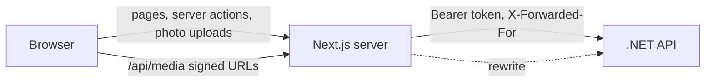

# Family Journal Web App

The web app (`familyjournalapp`, Next.js 16) is the only client today. Browsers never call the .NET API directly: the Next.js server does it for them, holding each person's sign-in in cookies.

## Signing in

- Sign-in and sign-up are server actions. The API's tokens go into two **httpOnly cookies** (`fj_at` access, `fj_rt` refresh), so browser JavaScript never sees them.
- The access cookie expires a minute before the token does. When it's gone, `src/proxy.ts` trades the refresh token for a new pair before the page renders. Requests that arrive together share one refresh, because the API treats a refresh token used twice as stolen and signs the person out everywhere.
- Signed-out visitors are sent to `/login?next=…`. `/login`, `/signup` and `/invite/{token}` work signed out.
- If the API rejects a token anyway, pages go to `/auth/expired`, which clears the cookies and shows sign-in.

## Routes

| Path | What it is |
|---|---|
| `/` | Sends you to the family you last viewed, or to `/welcome` |
| `/login`, `/signup`, `/welcome` | Sign in, create an account, start a family |
| `/invite/{token}` | Invite preview; join by claiming a profile or starting a new one |
| `/f/{familyId}` | The journal (feed), with `?person=` to filter |
| `/f/{familyId}/tree`, `/people`, `/people/{id}` | Tree, people, profiles |
| `/f/{familyId}/posts/{id}` | One post with every comment; notifications link here |
| `/f/{familyId}/notifications`, `/settings` | Activity; family name, roles, invites, sign out |

The family is in the URL so a link sent to a relative always opens the right family.

## Data

- **Reads** happen in Server Components through a typed client (`src/lib/server/api.ts`, built on `openapi-fetch`). Types are generated from the API's OpenAPI document: run `npm run api:types` with the API running after changing its models.
- **The family layout** loads the people, relationships and unread count once, and provides them to every page below it (`useFamily()`). Kinship, the tree layout and name lookups all work from that.
- **Writes** are server actions (`src/app/f/[familyId]/actions.ts`). Ones that change what the layout shows call `refresh()`, so the page re-renders with the change in the same round trip. Reactions and comments update the post in place instead.
- **Photos** upload through `/bff/families/{familyId}/media`, which streams to the API (server actions cap bodies at 1 MB). They're served at the API's signed URLs, which `next.config.ts` rewrites to the API so the API needn't be public, and `next/image` resizes them for each screen.
- **Crops** are numbers, not files. The whole photo is uploaded once, and `Media.Crops` (JSON) holds up to three rectangles, as fractions of the photo: `post`, `avatar` (circles) and `portrait` (tree and people cards). Profile photos are cropped circle first; the portrait is optional and, until someone sets it, is framed around the circle (`portraitAround`). `frame()` in `src/lib/photo.ts` picks the right one for each place and points at `/img/media/{id}?…&c=x,y,w,h`, where `sharp` cuts it out; `next/image` then resizes and caches it. Re-cropping only updates the numbers (`PUT …/media/{id}/crops`), so nothing is uploaded again.

## Running it

1. Start the API (it listens on `http://localhost:5092`). To use another address, set `API_URL`.
2. In `familyjournalapp`: `npm run dev`, then open http://localhost:3000.
3. Optional: `npm run seed` loads the Harlow family demo (accounts, tree, photos, posts) into an empty database. The sign-in is at the top of `scripts/seed.mts`.
